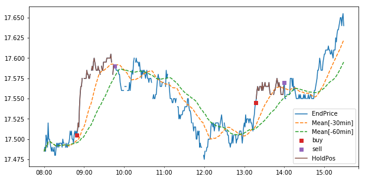

# Roadmap

After getting feedback about the project both internally at Originate and externally, we have found out that:

- stock market professionals are skeptical of how machine learning methods are applied to the stock market
- stock market professionals want rigorous proof of performance in their terms, not just prediction accuracy

## Learning Strategies with Machine Learning

To address the first issue we plan to develop trading strategies including such that are automatically tuned.
We found out that while machine learning itself is applicable to stock price prediction, prediction alone is not enough.
One needs to incorporate the machine learning prediction scores in a trading strategy. Often machine learning blogs 
and academic papers related to stock prediction stop short of showing results via a backtest, and thus the skeptisism.

## Demonstration on Quantopian

While having access to minute-by-minute data enables offline exploration of various methods, those methods cannot be reliably tested offline. Professionals require rigorous proofs of algorithm performance via:

- backtesting
- paper trading (simulated live trading without using real money)

We will address those issue be allowing the developed methods to work on [Quantopian](https://www.quantopian.com/).
Models deployed on Quantopian can be backtested and paper traded.

## More Examples

We will introduce more examples. In particular, we will use some common indicators, such as RSI and moving averages cross-over. Those will be very useful for baseline. For machine learning methods, we will introduce decision trees and specialized
Neural Network Architectures.

# Implementation Specifics

## Domain-specific language for trading strategy specification

We will introduce a domain specific language for expressing trading strategies. Below you will find some examples illustrating our approach. Similar domain specific languages are available in some trading platforms.
Our domain specfic language is an internal DSL, i.e. the code for the strategy is written at a high level in Python.

```python

position = Position()
s.add_position(position)

gain_threshold = 0.0008
loss_threshold = 0.001

s.add_rule('buy when our predictor score is high',
    When(position.is_empty()).and_when(score1 >= 0.0001). \
      and_when(score2 >= 0.0001). \
      and_when(score3 >= 0.0001). \
      and_when(score2 >= score3 + 0.00005). \
      action(buy).into(position)
)

s.add_rule(
    'liquidate position when we have enough gain and its going down (for long pos)',
    When(position.is_long()). \
        and_when(expected_gain(end_price, position) >= gain_threshold). \
        and_when(score2 <= 0.0). \
        action(liquidate).into(position)
)


s.add_rule(
    'liquidate position under stop-loss rule',
    When(position.is_active()).and_when(expected_loss(end_price, position) >= loss_threshold).action(liquidate).into(position)
)
```

The scores `score1`, `score2`, `score3` are based on the 30 and 60 min rolling means of the prices.



For example applying the strategy above to data for the stock 'RWE' on 2017-07-03 results in the following actions:

- Position 1
  - buy at 08:49:00
  - sell at 13:17:00
- Position 2
  - buy at 09:46:00
  - sell at 14:00:00

## Optimization of strategies

As seen above the specification of the strategy depends on a number of constants. Those need to be tuned on actual data.
We enable this by defining the constants as special type of variables that can be optimized by the backtester on a training dataset.

```python
gain_threshold = OptVariable(0.00001, 0.01)
loss_threshold = OptVariable(0.00001, 0.01)
# and in general replacing all majic constants by OptVariable with a range
```

In the example above, we had to manually derive the three variables `score`, but ideally this should be automated.

A natural extension of the approach is the so called end-to-end architecture in Machine Learning, where we can attempt to 
optimize the whole system, i.e. from the strategy to the machine learning method to feature synthesis.

## Domain-specific language for feature extraction and normalization

Our experience showed that dealing with time series, even when using Pandas, is error prone.
In particular, with shifting operations, one might leak data from the predicted variables into the features.
Other difficulties arise in dealing with discontinuities such as beginning and end of days, weekends, holidays.

Our code can be mapped to either
- efficient column oriented representation with Pandas. This is useful for backtesting.
- efficient streaming representation, useful for online testing with streaming data. In this representation only incremental computations will be carried out.

```python
def rolling_price(feature_name, steps, shift):
    return SF.raw_signal(feature_name). \
           rolling_window(dir="past", steps=steps, shift=shift, NAs='Ignore')

def rolling_end_price(steps, shift):
    return rolling_price('EndPrice', steps, shift)

def rolling_max_price(steps, shift):
    return rolling_price('MaxPrice', steps, shift)

def rolling_min_price(steps, shift):
    return rolling_price('MinPrice', steps, shift)

def future_mean_end_price(steps, shift):
    return SF.raw_signal('EndPrice'). \
           rolling_window(dir="future", steps=steps, shift=shift, NAs='Ignore'). \
           mean()

def direction_feature(steps, offset):
    x = rolling_end_price(steps, offset)
    return x.last().minus(x.first()).rename('D({}, {})'.format(steps, offset))
```

In the example above we define a direction feature which is the difference between the start and end price in some interval
in the past, defined by the steps and offset parameters.

## Special situations

There are a number of special situations in the stock market:

- end of day, start of day
- trade suspension during the day
- weekends

